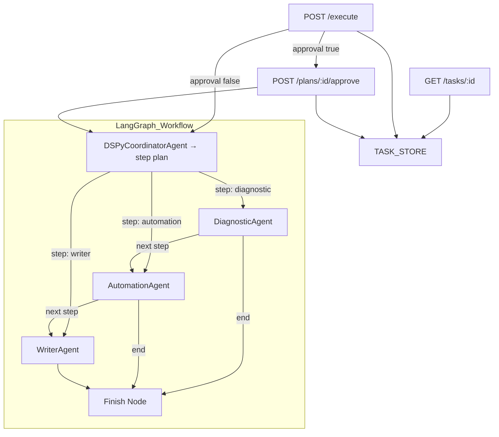

# AI Autopilot Microservice

## Overview
This project implements an agentic AI system that can process natural language IT requests, plan which specialized agents to run, execute them via LangGraph workflows, and return structured results. The system supports approval workflows and integrates advanced techniques like DSPy-based planning.

---

## Features
- FastAPI microservice with 4 endpoints
- LLM-powered agents:
  - **DSPyCoordinatorAgent** (plans steps dynamically)
  - **DiagnosticAgent** (identifies root cause and fixes)
  - **AutomationAgent** (generates and lints PowerShell/Bash scripts)
  - **WriterAgent** (generates summary, email, and SOP)
- LangGraph-based orchestration
- DSPy router component for dynamic planning
- Dummy finish node to ensure graceful termination

---

## API Endpoints
### `POST /api/v1/execute`
- Input: `{ prompt: str, require_approval: bool }`
- Behavior:
  - If `require_approval = true`, returns planned steps and status `waiting_approval`
  - If `false`, runs the full plan immediately

### `POST /api/v1/plans/:id/approve`
- Executes the planned steps

### `POST /api/v1/plans/:id/reject`
- Marks the plan as rejected

### `GET /api/v1/tasks/:id`
- Returns task status and results (if available)

---

## Architecture Diagram


---

## Advanced Techniques Used
- **DSPy Router Component**:
  - Replaces static rule-based planning with LLM-predicted step lists
  - Outputs e.g., `["diagnostic", "writer"]`

- **Context Pruning (manual MCP-style)**:
  - In `WriterAgent`, only essential diagnosis and script sections are passed
  - Reduces noise and token bloat

---

## Testing
Implemented with `pytest + httpx + langgraph`:
- `test_happy_path`
- `test_approval_flow`
- `test_agent_retry`
- `test_script_compiles`
- `test_task_status`

---

## Running the App
```bash
uvicorn app.main:app --reload
```

## Dependencies
```bash
pip install -r requirements.txt
```

## Notes
- LLM: OpenAI (GPT-3.5-turbo)
- Optional: shellcheck/pwsh for linting
- Task plans and states are stored in an in-memory `TASK_STORE`

---

## Example Prompt
```json
{
  "prompt": "Diagnose why Windows Server 2019 VM cpu01 hits 95%+ CPU, generate a PowerShell script, and draft an email to management summarising findings.",
  "require_approval": false
}
```
